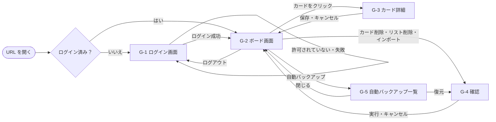
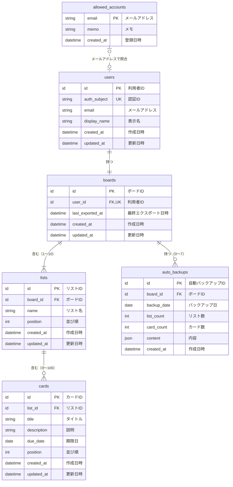

# 基本設計書：かんばん式タスク管理アプリ（Trello風）

| 項目 | 内容 |
| --- | --- |
| 文書番号 | KANBAN-BD |
| 版数 | 0.2 |
| 作成日 | 2026-10-03 |
| 最終更新日 | 2026-10-03 |
| 作成者 | （氏名） |
| 元にした文書 | 要件定義書（KANBAN-REQ）版数 0.4 |
| 状態 | 承認待ち |

## 改訂履歴

| 版数 | 日付 | 内容 | 作成者 |
| --- | --- | --- | --- |
| 0.1 | 2026-10-03 | 初版 | （氏名） |
| 0.2 | 2026-10-03 | 5 章の指摘を要件定義書 0.4 に反映したため、参照先を要件 ID に変更 | （氏名） |

## 承認

| 役割 | 氏名 | 承認日 | 署名 |
| --- | --- | --- | --- |
| 承認者 | | | |
| 作成者 | | | |

---

## 1. 概要

### 1.1 本書の目的

要件定義書で決めた「何ができるか」をもとに、「画面がどう見えて、どう動くか」と「どんなデータを、どんな形で持つか」を決める。

### 1.2 本書の範囲

| 章 | 内容 | 技術との関係 |
| --- | --- | --- |
| 2 章 | 画面設計 | 技術に依存しない |
| 3 章 | データ設計（論理 ER 図） | RDB を使うこと（要件定義書 P-1）だけを前提とし、製品には依存しない |
| 4 章 | 技術選定の後で行う設計（物理設計・運用設計） | 項目だけを挙げる。中身は技術選定の後に書く |
| 5 章 | 要件定義書に反映した事項 | 設計中に見つかった要件の不足と、その対応 |

### 1.3 表記のルール

- 「A-1」「C-3」などの ID は要件定義書の要件 ID を表す
- 「（第 2 版）」と書いたものは第 2 版で作る。書いていないものは第 1 版で作る
- 図は Mermaid 記法で書く。VS Code で図として見るには、拡張機能「Markdown Preview Mermaid Support」を入れてプレビューを開く

---

## 2. 画面設計

### 2.1 画面一覧

| 画面 ID | 名称 | 種類 | 版 | 関連要件 |
| --- | --- | --- | --- | --- |
| G-1 | ログイン画面 | 画面 | 第 1 版 | A-1〜A-3 |
| G-2 | ボード画面 | 画面 | 第 1 版（一部第 2 版） | B、L、C、D、K の各要件 |
| G-3 | カード詳細ダイアログ | ダイアログ | 第 2 版 | C-12〜C-16 |
| G-4 | 確認ダイアログ | ダイアログ | 第 1 版 | C-6、L-8、K-5、K-13 |
| G-5 | 自動バックアップ一覧ダイアログ | ダイアログ | 第 2 版 | K-12、K-13 |

### 2.2 画面遷移図



G-5 から開いた G-4 で「置き換える」を押した場合は、G-4 と G-5 を両方閉じて G-2 に戻る。「キャンセル」の場合は G-5 に戻る。

### 2.3 共通仕様

#### 2.3.1 色

| 名前 | 用途 | 色 |
| --- | --- | --- |
| 画面背景 | ボード画面・ログイン画面の背景 | #F4F5F7 |
| リスト背景 | リストの背景 | #EBECF0 |
| カード背景 | カード・ダイアログ・ヘッダーの背景 | #FFFFFF |
| 文字 | 通常の文字 | #172B4D |
| 補足文字 | 件数・日時など | #5E6C84 |
| 主色 | 主ボタンの背景、挿入位置の線 | #0052CC |
| 危険色 | 削除ボタンの背景、エラーの文字、「期限切れ」 | #AE2A19 |
| 注意色 | 「今日まで」の文字 | #A54800 |
| ドロップ先 | ドラッグ中、離すと入る先のリストの背景 | #DEEBFF |
| お知らせ（注意） | バックアップ案内の背景 | #FFF4E5 |
| お知らせ（警告） | 通信切れの背景 | #FFEBE6 |
| 背景の覆い | ダイアログを開いたときに後ろの画面を覆う色 | 黒・透明度 50% |

文字と背景の組み合わせは、実装時にコントラストを確認するツールで 4.5:1 以上（N-16）であることを確かめる。

#### 2.3.2 文字

| 対象 | 大きさ | 太さ |
| --- | --- | --- |
| アプリ名（ヘッダー） | 20px | 太字 |
| ダイアログの見出し | 18px | 太字 |
| リスト名 | 16px | 太字 |
| その他すべて | 14px | 標準 |

書体は、Windows では「メイリオ」または「Yu Gothic UI」、macOS では「ヒラギノ角ゴシック」を使う（OS に入っているものを使い、書体ファイルは配布しない）。

#### 2.3.3 ボタン

| 種類 | 見た目 | 使う場所 |
| --- | --- | --- |
| 主ボタン | 主色の背景・白い文字 | 追加、保存、Google でログイン |
| 通常ボタン | 枠線のみ・文字色 | キャンセル、閉じる、ヘッダーのボタン |
| 危険ボタン | 危険色の背景・白い文字 | 削除、置き換える |

- 高さ 32px、角の丸み 4px、左右の余白 12px
- マウスを乗せるとカーソルを指の形にし、背景を 10% 暗くする（N-18）
- 押せない状態のときは、透明度 50% で表示し、カーソルを禁止マークにする

#### 2.3.4 メッセージの表示方法

| 方法 | 位置 | 消えるとき | 使うメッセージ |
| --- | --- | --- | --- |
| 入力欄の下 | 入力欄のすぐ下に危険色の文字 | その入力欄に文字を入力したとき、または入力欄を閉じたとき | M-3、M-4、M-5 |
| お知らせ欄 | ヘッダーのすぐ下、画面の横幅いっぱい | 原因がなくなったとき | M-8、M-13 |
| トースト | 画面の下中央、幅 360px の枠。右端に「×」 | 「×」を押したとき、または次の操作をしたとき。同時に表示するのは 1 つで、新しいものが出たら古いものは消す | M-9、M-11、M-12、M-14 |
| ダイアログ | G-4 | ボタンを押したとき | M-6、M-7、M-10 |
| ログイン画面 | 「Google でログイン」ボタンの下 | 次に「Google でログイン」を押したとき | M-1、M-2 |

#### 2.3.5 ダイアログ共通

- 画面の中央に表示し、後ろの画面を「背景の覆い」で覆う。開いている間は後ろの画面を操作できない
- Esc キー、または覆いの部分のクリックで、「キャンセル」と同じ動きをする
- 開いたときは、G-3 ではタイトル入力欄に、G-4・G-5 では「キャンセル」「閉じる」ボタンにカーソルを置く（Enter キーを押したときに、データが失われる操作を誤って実行しないため）

#### 2.3.6 画面の状態と、できる操作

| 状態 | なるとき | できる操作 |
| --- | --- | --- |
| 読み込み中 | ボードのデータを読み込んでいる間（B-3） | ログアウトのみ |
| 通常 | 上記以外 | すべての操作 |
| 通信切れ | インターネットに接続できないとき（D-4） | ログアウトのみ。追加・削除・移動・変更に加え、エクスポート・インポート・自動バックアップの表示と復元もできない（D-4） |

できない操作のボタン・入力欄は「押せない状態」で表示し、カードはドラッグできないようにする。

#### 2.3.7 入力の共通ルール

- 1 行の入力欄で Enter キーを押すと、その入力欄の「追加」または「保存」と同じ動きをする
- 日本語入力の変換を確定するための Enter キーでは追加・保存しない
- 前後の空白（半角スペース・全角スペース・タブ・改行）を取り除いてから、文字数の確認と保存を行う
- 文字数の上限を超える文字は入力できないようにする。文字数は要件定義書の用語「文字数」のとおり、Unicode の文字（コードポイント）単位で数える

#### 2.3.8 日付・日時の表示

- 日付：「2026/10/15」
- 日時：「2026/10/03 15:30」（日本時間、24 時間表記）

### 2.4 G-1 ログイン画面

#### レイアウト

```
┌──────────────────────────────────────────┐
│                                          │
│              タスクボード                 │
│                                          │
│         [  Google でログイン  ]          │
│      このアカウントでは利用できません。    │ ← メッセージ（ある場合のみ）
│                                          │
└──────────────────────────────────────────┘
```

画面の中央に、幅 360px の白い枠で表示する。

#### 表示項目

| No | 項目 | 種類 | 内容 |
| --- | --- | --- | --- |
| 1 | アプリ名 | 文字 | 「タスクボード」 |
| 2 | Google でログイン | 主ボタン | |
| 3 | メッセージ | 文字（危険色） | M-1 または M-2。ない場合は表示しない |

#### 操作

| 操作 | 処理 | 結果 | 要件 |
| --- | --- | --- | --- |
| 「Google でログイン」を押す | Google のログイン画面を別ウィンドウで開く | | A-1 |
| Google でログインが完了 | 許可リストを確認する | 許可されていれば G-2 を表示。許可されていなければログアウトさせ、M-1 を表示 | A-2、A-3 |
| ログインのウィンドウを閉じた・失敗した | | M-2 を表示 | 10 章 M-2 |

### 2.5 G-2 ボード画面

#### レイアウト

```
┌──────────────────────────────────────────────────────────────────────────┐
│ タスクボード    山田 太郎 [エクスポート][インポート][自動バックアップ][ログアウト] │ ← ヘッダー 高さ 56px
├──────────────────────────────────────────────────────────────────────────┤
│ ⚠ 最後のバックアップから 7 日以上たっています。 [エクスポート]           │ ← お知らせ欄（ある場合のみ）
├──────────────────────────────────────────────────────────────────────────┤
│  ┌272px─────────┐ 8px ┌──────────────┐     ┌──────────────┐ ┌──────────┐ │
│  │未着手 (2)  … │     │作業中 (1)  … │     │完了 (1)    … │ │＋リストを│ │
│  │┌────────────┐│     │┌────────────┐│     │┌────────────┐│ │  追加    │ │
│  ││買い物     ×││     ││レポート   ×││     ││掃除       ×││ └──────────┘ │
│  ││2026/10/15  ││     ││≡           ││     │└────────────┘│              │
│  ││  期限切れ  ││     │└────────────┘│     │              │              │
│  │└────────────┘│     │              │     │              │              │
│  │┌────────────┐│     │              │     │              │              │
│  ││本を返す   ×││     │              │     │              │              │
│  │└────────────┘│     │              │     │              │              │
│  │[入力欄][追加]│     │[入力欄][追加]│     │[入力欄][追加]│              │
│  └──────────────┘     └──────────────┘     └──────────────┘              │
│                                                                          │
│                     ┌ 保存に失敗しました。…        × ┐                   │ ← トースト（ある場合のみ）
└──────────────────────────────────────────────────────────────────────────┘
```

#### 各部分の大きさ・配置

| 部分 | 内容 |
| --- | --- |
| ヘッダー | 高さ 56px、画面上部に固定。左右の余白 16px |
| ボード | ヘッダー（とお知らせ欄）の下の残り全体。上下左右の余白 16px。リストが入りきらないときは横スクロール |
| リスト | 幅 272px、リストどうしの間隔 8px、角の丸み 8px、内側の余白 8px。高さはカードの量に合わせて伸び、ボードの高さで止まる。止まった後はカードの部分だけ縦スクロール（リスト名と入力欄は常に見える） |
| カード | リストの幅いっぱい、カードどうしの間隔 8px、内側の余白 8px、角の丸み 4px、薄い影をつける |

#### 表示項目

| No | 部分 | 項目 | 種類 | 内容 | 要件 |
| --- | --- | --- | --- | --- | --- |
| 1 | ヘッダー | アプリ名 | 文字 | 「タスクボード」 | |
| 2 | ヘッダー | 表示名 | 文字 | Google アカウントの表示名 | 9.5 |
| 3 | ヘッダー | エクスポート | 通常ボタン | | K-1 |
| 4 | ヘッダー | インポート | 通常ボタン | | K-4 |
| 5 | ヘッダー | 自動バックアップ | 通常ボタン | （第 2 版） | K-12 |
| 6 | ヘッダー | ログアウト | 通常ボタン | | A-5 |
| 7 | お知らせ欄 | 通信切れ | お知らせ（警告） | M-8 | D-4 |
| 8 | お知らせ欄 | バックアップ案内 | お知らせ（注意） | M-13 と「エクスポート」ボタン。通信切れと同時の場合は通信切れを上に表示 | K-8 |
| 9 | ボード | 読み込み中 | 文字 | ボード中央に「読み込み中…」 | B-3 |
| 10 | リスト | リスト名 | 文字 | 長くて入りきらない場合は折り返す | |
| 11 | リスト | カード枚数 | 補足文字 | 「(3)」の形式 | B-4 |
| 12 | リスト | 「…」 | ボタン | リストのメニューを開く（第 2 版） | L-6、L-8 |
| 13 | リスト | カード | 部品 | 並び順（3.4.5 の並び順）の小さい順に上から並べる | |
| 14 | リスト | タイトル入力欄 | 1 行入力 | 薄い文字の案内「カードのタイトル」。最大 100 文字 | C-1、C-3 |
| 15 | リスト | 追加 | 主ボタン | | C-1 |
| 16 | カード | タイトル | 文字 | 全文を表示し、入りきらない場合は折り返す | |
| 17 | カード | × | ボタン | 右上に常に表示 | C-6 |
| 18 | カード | 期限日 | 補足文字 | 「2026/10/15」。今日なら横に注意色で「今日まで」、過ぎていれば危険色で「期限切れ」（第 2 版） | C-17 |
| 19 | カード | 説明あり | 補足文字 | 「≡」（第 2 版） | C-18 |
| 20 | ボード右端 | ＋リストを追加 | 通常ボタン | リスト数が 10 のときは表示しない（第 2 版） | L-1、L-5 |
| 21 | トースト | メッセージ | 枠 | 2.3.4 のとおり | |

#### リストのメニュー（第 2 版）

「…」を押すと、そのすぐ下に次の 2 つを縦に並べて表示する。メニューの外をクリックするか Esc キーで閉じる。

| 項目 | 内容 |
| --- | --- |
| 名前を変更 | リスト名を入力欄に変える（L-6） |
| 削除 | G-4 を開く（L-8）。リストが 1 つのときは押せない状態にする（L-9） |

#### 操作

| 操作 | 処理 | 成功したとき | 失敗したとき | 要件 |
| --- | --- | --- | --- | --- |
| 「追加」・Enter（カード） | 入力値の確認 → 保存 | リストの一番下にカードを表示。入力欄を空にしてカーソルを残す | 空：M-3、上限：M-5 を入力欄の下に表示。保存失敗：M-9 を表示し、カードを消して入力欄に文字を戻す | C-1〜C-5、D-6 |
| 「×」（カード） | G-4 を開く。「削除」で削除して保存 | カードを消し、下のカードを詰める | M-9 を表示し、カードを元に戻す | C-6、D-6 |
| カードをドラッグ | ドラッグ中のカードを透明度 50% で表示。離すと入る先のリストの背景をドロップ先の色にする（第 2 版：入る位置に主色で太さ 2px の線を表示） | | | C-8、C-10 |
| 別のリストの上で離す | 移動して保存 | 第 1 版：そのリストの一番下に表示。第 2 版：線の位置に表示 | M-9 を表示し、元の位置に戻す | C-7、C-11、D-6 |
| 同じリストで離す（第 2 版） | 並べ替えて保存 | 線の位置に表示 | M-9 を表示し、元の位置に戻す | C-10 |
| リストの外で離す | 何もしない | 元の位置に戻す | | C-9 |
| 上限（100 枚）のリストに離す | 移動しない | 元の位置に戻し、M-5 をトーストで表示 | | C-5 |
| カードをクリック（第 2 版） | G-3 を開く | | | C-12 |
| 「＋リストを追加」（第 2 版） | ボタンを、リスト名の入力欄・「追加」「×」に置き換える | | | L-1 |
| 「追加」・Enter（リスト）（第 2 版） | 入力値の確認 → 保存 | 右端にリストを表示し、入力欄を閉じる | 空：M-4。保存失敗：M-9 | L-2〜L-5 |
| 「×」・Esc（リスト追加）（第 2 版） | 入力欄を閉じる | | | |
| 名前を変更 → Enter・外をクリック（第 2 版） | 入力値の確認 → 保存 | 新しい名前を表示 | 空：元の名前に戻す。保存失敗：M-9、元の名前に戻す | L-6 |
| 名前を変更 → Esc（第 2 版） | 取り消す | 元の名前に戻す | | L-6 |
| 削除（リスト）（第 2 版） | G-4 を開く。「削除」でリストと中のカードを削除して保存 | リストを消し、右側のリストを左に詰める | M-9、元に戻す | L-8 |
| 「エクスポート」 | ファイルを作ってダウンロードし、最終エクスポート日時を保存 | ダウンロードが始まり、バックアップ案内を消す | M-9 | K-1〜K-3、K-8 |
| 「インポート」 | ファイル選択画面を開く（.json のみ）→ ファイルを確認 → G-4 を開く。「置き換える」で置き換えて保存 | ボードを表示し直し、M-11 を表示 | ファイルの問題：M-12。保存失敗：M-9 で、データは変えない | K-4〜K-7 |
| 「自動バックアップ」（第 2 版） | G-5 を開く | | | K-12 |
| 「ログアウト」 | ログアウト | G-1 を表示 | | A-5 |
| ほかの画面での変更を受け取る | 画面に反映する | 5 秒以内に表示が変わる。G-3 で編集中のカードがほかの画面で削除された場合は、G-3 を閉じて M-14 を表示 | | D-3、D-8 |

画面への反映は、保存の完了を待たずに行う（N-2 の 0.5 秒を守るため）。保存に失敗した場合は、上の表の「失敗したとき」のとおり元に戻す。

### 2.6 G-3 カード詳細ダイアログ（第 2 版）

#### レイアウト

```
┌ カードの詳細 ─────────────────────────────── ┐
│ タイトル                                       │
│ [ 買い物                                     ] │
│                                                │
│ 説明                                            │
│ ┌────────────────────────────────────────────┐ │
│ │ 牛乳、卵、パン                              │ │
│ │                                             │ │
│ └────────────────────────────────────────────┘ │
│                                      12 / 1000 │
│ 期限日                                          │
│ [ 2026/10/15 ] [期限をなくす]                   │
│                                                │
│ 作成：2026/10/03 15:30   更新：2026/10/04 09:12 │
│                                                │
│                          [キャンセル] [ 保存 ]  │
└────────────────────────────────────────────────┘
```

幅 600px。

#### 表示項目

| No | 項目 | 種類 | 内容 | 要件 |
| --- | --- | --- | --- | --- |
| 1 | タイトル | 1 行入力 | 最大 100 文字。入力エラーのときは下に M-3 | C-14 |
| 2 | 説明 | 複数行入力 | 高さ 6 行分。超えたら入力欄の中で縦スクロール。最大 1,000 文字 | C-15 |
| 3 | 文字数 | 補足文字 | 「現在の文字数 / 1000」 | |
| 4 | 期限日 | 日付入力 | 押すとカレンダーを表示 | C-16 |
| 5 | 期限をなくす | 通常ボタン | 期限日を空にする | C-16 |
| 6 | 作成日時・更新日時 | 補足文字 | 表示のみ | |
| 7 | キャンセル | 通常ボタン | | C-13 |
| 8 | 保存 | 主ボタン | | C-13 |

#### 操作

| 操作 | 結果 | 要件 |
| --- | --- | --- |
| 「保存」・タイトル欄で Enter | 入力値を確認し、保存してダイアログを閉じる。タイトルが空なら M-3 を表示して閉じない。保存に失敗したら M-9 を表示し、ダイアログは開いたまま入力内容を残す（もう一度「保存」を押せる） | C-13、C-14、D-6 |
| 「キャンセル」・Esc・覆いのクリック | 確認なしで、変更を捨てて閉じる | C-13 |

### 2.7 G-4 確認ダイアログ

#### レイアウト

```
┌ カードの削除 ──────────────────────┐
│                                      │
│ カード「買い物」を削除しますか？      │
│                                      │
│              [キャンセル] [ 削除 ]   │
└──────────────────────────────────────┘
```

幅 400px。

#### 用途ごとの内容

| 用途 | 見出し | メッセージ | 実行ボタン | 要件 |
| --- | --- | --- | --- | --- |
| カードの削除 | カードの削除 | M-6 | 削除（危険ボタン） | C-6 |
| リストの削除 | リストの削除 | M-7 | 削除（危険ボタン） | L-8 |
| インポート | インポート | M-10 | 置き換える（危険ボタン） | K-5 |
| 自動バックアップからの復元 | 復元 | M-10 | 置き換える（危険ボタン） | K-13 |

メッセージ中のタイトル・リスト名が 30 文字を超える場合は、31 文字目以降を「…」に置き換える。

### 2.8 G-5 自動バックアップ一覧ダイアログ（第 2 版）

#### レイアウト

```
┌ 自動バックアップ ───────────────────────────┐
│    日時                リスト   カード        │
│ ( ) 2026/10/10 08:15     3        12          │
│ (●) 2026/10/09 21:03     3        11          │
│ ( ) 2026/10/08 07:40     3         9          │
│                                               │
│                         [閉じる] [ 復元 ]     │
└───────────────────────────────────────────────┘
```

幅 480px。

#### 表示項目・操作

| No | 項目 | 内容 | 要件 |
| --- | --- | --- | --- |
| 1 | 一覧 | 日時・リストの数・カードの枚数を新しい順に最大 7 行。行のどこを押しても選択できる | K-12 |
| 2 | 0 件のとき | 一覧の代わりに「自動バックアップはまだありません。」 | |
| 3 | 閉じる | ダイアログを閉じる | |
| 4 | 復元 | 1 行選ぶまでは押せない。押すと G-4（復元）を開く | K-13 |

---

## 3. データ設計

### 3.1 方針

| No | 方針 | 理由 |
| --- | --- | --- |
| 1 | RDB で扱う形（表と表のつながり）で設計し、第 3 正規形を基本とする | P-1。同じデータを 2 か所に持たないことで、食い違いを防ぐ |
| 2 | 各データを区別する ID は、推測されにくい一意の値（UUID など）とする | 連番だと、ほかの利用者のデータの ID を推測しやすくなるため |
| 3 | 削除は、データを実際に消す方式（物理削除）とする | 「元に戻す」機能がなく（要件 2.2）、復元はバックアップで行うため |
| 4 | 日時はタイムゾーン付きで保存し、画面では日本時間で表示する | 海外のサーバーを使っても時刻がずれないようにするため |
| 5 | 物理名（英語の名前）は、技術選定の後でそのまま使えるように案として付けておく | |

### 3.2 エンティティ一覧

| 論理名 | 物理名（案） | 内容 | 件数の目安 | 版 |
| --- | --- | --- | --- | --- |
| 許可アカウント | allowed_accounts | アプリを使ってよいメールアドレス | 最大 5 件 | 第 1 版 |
| 利用者 | users | 一度でもログインした人 | 最大 5 件 | 第 1 版 |
| ボード | boards | 利用者のボード（1 人 1 つ） | 最大 5 件 | 第 1 版 |
| リスト | lists | ボードの中の列 | 1 ボードに 1〜10 件 | 第 1 版 |
| カード | cards | タスク | 1 ボードに 0〜500 件 | 第 1 版 |
| 自動バックアップ | auto_backups | ボードの 1 日 1 回の控え | 1 ボードに 0〜7 件 | 第 2 版 |

#### ボードを利用者と分けた理由

今は 1 人 1 ボードなので、利用者の項目にまとめることもできる。ただし「複数のボード」は対象外（要件 2.2）として挙げており、今後追加する候補である。分けておけば、そのときに表の作りを変えずに済む。

### 3.3 ER 図



線の記号の意味：`||` はちょうど 1、`|o` は 0 または 1、`|{` は 1 以上、`o{` は 0 以上。点線（`..`）は、外部キーでつながっていない関係を表す。

### 3.4 エンティティ定義

型の書き方：ID ＝ 3.1 の方針 2 の一意の値、文字列(n) ＝ 最大 n 文字、整数、日付（年月日）、日時（タイムゾーン付き）、JSON。

#### 3.4.1 許可アカウント（allowed_accounts）

| No | 論理名 | 物理名（案） | 型 | 必須 | キー | 初期値 | 説明 |
| --- | --- | --- | --- | --- | --- | --- | --- |
| 1 | メールアドレス | email | 文字列(254) | ○ | 主キー | | すべて小文字にして保存する |
| 2 | メモ | memo | 文字列(100) | | | 空 | 誰のアカウントか（例：「作成者」「検収者」） |
| 3 | 登録日時 | created_at | 日時 | ○ | | 登録した時刻 | |

- 登録・削除は作成者が管理者としてデータベースに直接行う。アプリの画面からは行わない（手順は 4.2 の運用設計で定める）
- 利用者とは外部キーでつながない。許可リストから外しても、その利用者のデータは消さずに残し、再び登録すれば元のデータを使える

#### 3.4.2 利用者（users）

| No | 論理名 | 物理名（案） | 型 | 必須 | キー | 初期値 | 説明 |
| --- | --- | --- | --- | --- | --- | --- | --- |
| 1 | 利用者 ID | id | ID | ○ | 主キー | 自動 | |
| 2 | 認証 ID | auth_subject | 文字列(255) | ○ | 一意 | | ログインのサービス（Google）が発行する、その人固有の ID。メールアドレスは変わることがあるので、本人の確認にはこちらを使う |
| 3 | メールアドレス | email | 文字列(254) | ○ | | | ログインのたびに最新の値で上書きする。すべて小文字 |
| 4 | 表示名 | display_name | 文字列(255) | ○ | | | ログインのたびに最新の値で上書きする |
| 5 | 作成日時 | created_at | 日時 | ○ | | 作成した時刻 | |
| 6 | 更新日時 | updated_at | 日時 | ○ | | 更新した時刻 | |

#### 3.4.3 ボード（boards）

| No | 論理名 | 物理名（案） | 型 | 必須 | キー | 初期値 | 説明 |
| --- | --- | --- | --- | --- | --- | --- | --- |
| 1 | ボード ID | id | ID | ○ | 主キー | 自動 | |
| 2 | 利用者 ID | user_id | ID | ○ | 外部キー（users）・一意 | | 一意にすることで「1 人 1 ボード」を守る |
| 3 | 最終エクスポート日時 | last_exported_at | 日時 | | | なし | 一度もエクスポートしていない場合は値なし（K-8） |
| 4 | 作成日時 | created_at | 日時 | ○ | | 作成した時刻 | |
| 5 | 更新日時 | updated_at | 日時 | ○ | | 更新した時刻 | |

#### 3.4.4 リスト（lists）

| No | 論理名 | 物理名（案） | 型 | 必須 | キー | 初期値 | 説明 |
| --- | --- | --- | --- | --- | --- | --- | --- |
| 1 | リスト ID | id | ID | ○ | 主キー | 自動 | |
| 2 | ボード ID | board_id | ID | ○ | 外部キー（boards） | | |
| 3 | リスト名 | name | 文字列(20) | ○ | | | 前後の空白を取り除いた後で 1〜20 文字 |
| 4 | 並び順 | position | 整数 | ○ | | | 左から 0, 1, 2 …（BR-3） |
| 5 | 作成日時 | created_at | 日時 | ○ | | 作成した時刻 | |
| 6 | 更新日時 | updated_at | 日時 | ○ | | 更新した時刻 | |

#### 3.4.5 カード（cards）

| No | 論理名 | 物理名（案） | 型 | 必須 | キー | 初期値 | 説明 |
| --- | --- | --- | --- | --- | --- | --- | --- |
| 1 | カード ID | id | ID | ○ | 主キー | 自動 | |
| 2 | リスト ID | list_id | ID | ○ | 外部キー（lists） | | |
| 3 | タイトル | title | 文字列(100) | ○ | | | 前後の空白を取り除いた後で 1〜100 文字 |
| 4 | 説明 | description | 文字列(1000) | ○ | | 空文字 | 説明がない状態は、「値なし」ではなく空文字 1 種類で表す（「ない」の表し方を 2 通りにしないため） |
| 5 | 期限日 | due_date | 日付 | | | なし | 期限がない場合は値なし |
| 6 | 並び順 | position | 整数 | ○ | | | 上から 0, 1, 2 …（BR-3） |
| 7 | 作成日時 | created_at | 日時 | ○ | | 作成した時刻 | |
| 8 | 更新日時 | updated_at | 日時 | ○ | | 更新した時刻 | 別のリストへの移動、並べ替えでも更新する |

カードにはボード ID を持たせない。リスト ID からたどれるため（3.1 の方針 1）。

#### 3.4.6 自動バックアップ（auto_backups）（第 2 版）

| No | 論理名 | 物理名（案） | 型 | 必須 | キー | 初期値 | 説明 |
| --- | --- | --- | --- | --- | --- | --- | --- |
| 1 | 自動バックアップ ID | id | ID | ○ | 主キー | 自動 | |
| 2 | ボード ID | board_id | ID | ○ | 外部キー（boards） | | |
| 3 | バックアップ日 | backup_date | 日付 | ○ | | | パソコンの日付（K-10）。ボード ID とバックアップ日の組み合わせを一意にし、「1 日 1 回」を守る |
| 4 | リスト数 | list_count | 整数 | ○ | | | G-5 の表示用 |
| 5 | カード数 | card_count | 整数 | ○ | | | G-5 の表示用 |
| 6 | 内容 | content | JSON | ○ | | | 3.8 のファイル形式と同じ内容 |
| 7 | 作成日時 | created_at | 日時 | ○ | | 作成した時刻 | G-5 の「日時」に表示 |

リスト数とカード数は「内容」から数えられるので、本来は持たなくてよい項目である。一覧を表示するたびに最大 7 件の「内容」を全部読むのを避けるため、あえて持たせる。バックアップは作成後に変更しないため、食い違いは起きない。

### 3.5 リレーションシップ定義

| 親 | 子 | 多重度 | 親を削除したときの子 | 説明 |
| --- | --- | --- | --- | --- |
| 利用者 | ボード | 1 対 1 | 一緒に削除 | 利用者を削除する機能はない。運用で削除する場合に備えて決めておく |
| ボード | リスト | 1 対 1〜10 | 一緒に削除 | |
| リスト | カード | 1 対 0〜100 | 一緒に削除 | L-8 |
| ボード | 自動バックアップ | 1 対 0〜7 | 一緒に削除 | |
| 許可アカウント | 利用者 | 0..1 対 0..1 | 影響なし | 外部キーではなく、ログイン時にメールアドレスで照合する（3.4.1） |

### 3.6 データのルール

| ID | ルール | 関連要件 |
| --- | --- | --- |
| BR-1 | 1 つのボードのリストは 1〜10 個 | L-5、L-9 |
| BR-2 | 1 つのリストのカードは 0〜100 枚、1 つのボードのカードは 0〜500 枚 | C-5 |
| BR-3 | 並び順は、同じボードのリストどうし・同じリストのカードどうしで 0 から始まる連番とし、重複も欠番も作らない。追加・削除・移動・並べ替えのたびに、影響する範囲を振り直す | C-7、C-10 |
| BR-4 | 文字列は前後の空白を取り除いてから保存する | C-3、L-3 |
| BR-5 | 自動バックアップは 1 ボードにつき 1 日 1 件まで、最大 7 件。8 件目を作るときは、バックアップ日が最も古いものを削除する | K-10、K-11 |
| BR-6 | 次の処理は、関係する変更をまとめて行い、全部成功するか全部やめるかのどちらかにする（途中までの状態を残さない）：初回のボード作成、カードの移動・並べ替え・削除、リストの削除、インポート、復元、自動バックアップの作成 | D-6 |
| BR-7 | 変更するたびに更新日時を更新する。同じデータへの変更が重なった場合は、後から届いた変更を有効にする | D-7 |
| BR-8 | 利用者は、自分のボードと、その中のリスト・カード・自動バックアップだけを読み書きできる。これをサーバー側で制限する | N-10〜N-12 |
| BR-9 | BR-1・BR-2 の上限の確認はサーバー側でも行う（2 つの画面から同時に追加した場合でも上限を超えないようにするため） | C-5 |

### 3.7 CRUD 表

C ＝ 作成、R ＝ 読み取り、U ＝ 更新、D ＝ 削除

| 機能 | 要件 | 許可アカウント | 利用者 | ボード | リスト | カード | 自動バックアップ |
| --- | --- | --- | --- | --- | --- | --- | --- |
| ログイン | A-2、A-3 | R | C R U | | | | |
| 初回のボード作成 | B-1 | | | C | C | | |
| ボード表示 | B-2 | | R | R | R | R | |
| カード追加 | C-1 | | | | R | C R | |
| カード削除 | C-6 | | | | | U D | |
| カード移動・並べ替え | C-7、C-10、C-11 | | | | R | R U | |
| カード編集 | C-13 | | | | | U | |
| リスト追加 | L-2 | | | | C R | | |
| リスト名変更 | L-6 | | | | U | | |
| リスト削除 | L-8 | | | | U D | D | |
| エクスポート | K-1 | | | R U | R | R | |
| バックアップ案内 | K-8 | | | R | | | |
| インポート | K-6 | | | | C D | C D | |
| 自動バックアップ作成 | K-10、K-11 | | | | R | R | C R D |
| 自動バックアップ一覧 | K-12 | | | | | | R |
| 復元 | K-13 | | | | C D | C D | R |

### 3.8 エクスポートファイルの形式（K-3）

自動バックアップの「内容」も同じ形式とする。

```json
{
  "formatVersion": 1,
  "exportedAt": "2026-10-03T15:30:00+09:00",
  "lists": [
    {
      "name": "未着手",
      "position": 0,
      "createdAt": "2026-10-01T09:00:00+09:00",
      "updatedAt": "2026-10-01T09:00:00+09:00",
      "cards": [
        {
          "title": "買い物",
          "description": "牛乳、卵、パン",
          "dueDate": "2026-10-15",
          "position": 0,
          "createdAt": "2026-10-02T10:00:00+09:00",
          "updatedAt": "2026-10-02T10:05:00+09:00"
        }
      ]
    }
  ]
}
```

| 項目 | 型 | 必須 | 条件 |
| --- | --- | --- | --- |
| formatVersion | 整数 | ○ | 1 |
| exportedAt | 日時（ISO 8601 形式） | ○ | |
| lists | 配列 | ○ | 1〜10 個 |
| lists[].name | 文字列 | ○ | 前後の空白を取り除いた後で 1〜20 文字 |
| lists[].position | 整数 | ○ | 0 から始まる連番 |
| lists[].createdAt / updatedAt | 日時（ISO 8601 形式） | ○ | |
| lists[].cards | 配列 | ○ | 0〜100 個。全リスト合計で 0〜500 個 |
| cards[].title | 文字列 | ○ | 前後の空白を取り除いた後で 1〜100 文字 |
| cards[].description | 文字列 | ○ | 0〜1,000 文字 |
| cards[].dueDate | 日付（YYYY-MM-DD）または null | ○ | |
| cards[].position | 整数 | ○ | リストの中で 0 から始まる連番 |
| cards[].createdAt / updatedAt | 日時（ISO 8601 形式） | ○ | |

- ID はファイルに含めない。インポート・復元のときは新しい ID を付ける（ほかのデータと ID がぶつかるのを防ぐため）
- 作成日時・更新日時は、ファイルの値をそのまま戻す
- 上の条件を 1 つでも満たさないファイルは、読み込まずに M-12 を表示する（K-7）
- 上限いっぱいのデータでエクスポートすると約 1.7MB になる（3.9）。読み込めるのは 3MB までとする（K-7）

### 3.9 データ量の見積もり

日本語 1 文字を 3 バイトとして、最も多い場合を計算する。

| 対象 | 計算 | 量 |
| --- | --- | --- |
| カード 1 枚 | タイトル 100 文字 × 3 ＋ 説明 1,000 文字 × 3 ＋ その他 約 200 | 約 3.5KB |
| ボード 1 つ（カード 500 枚） | 3.5KB × 500 ＋ リスト | 約 1.7MB |
| 自動バックアップ（7 件） | 1.7MB × 7 | 約 12MB |
| 利用者 1 人分 | 1.7MB ＋ 12MB | 約 14MB |
| 全体（5 人） | 14MB × 5 | 約 70MB |

技術選定では、無料プランのデータベースの容量がこの量（約 70MB）を超えていることを確認する。

---

## 4. 技術選定の後で行う設計

技術選定の結果は開発計画書に記録し、その後で本書に次の章を追加する。

### 4.1 物理設計

| 項目 | 内容 |
| --- | --- |
| テーブル定義 | 3.4 の型を、選んだ RDB の実際の型に置き換える |
| DDL | テーブルを作る SQL 文 |
| 制約 | 主キー・外部キー・一意・文字数・件数の制約を、データベースでどこまで守るかを決める |
| インデックス | よく使う検索のための索引（例：リストはボード ID と並び順、カードはリスト ID と並び順、自動バックアップはボード ID とバックアップ日） |
| 権限設定 | BR-8 を守るための、行ごとのアクセス制御 |
| 文字数の数え方 | 画面とデータベースで、文字数の数え方（コードポイント単位）を揃える |

### 4.2 運用設計

| 項目 | 内容 |
| --- | --- |
| 環境の作り方 | データベースの作成と初期設定の手順 |
| 表の変更の管理 | 表の作りを変えるときの手順と履歴の残し方（マイグレーション） |
| 許可アカウントの管理 | 追加・削除の手順 |
| データベースのバックアップと復旧 | サービスの機能で何ができるか、使えない場合にエクスポートで補う方法、復旧の手順 |
| 使用量の確認 | 月 1 回の確認手順（R-1） |
| 障害時の対応 | 障害に気づく方法、利用者への連絡、復旧後の確認 |

### 4.3 技術選定で確認すること

本書の設計から、使う製品・サービスには次のことが求められる。

| No | 確認すること | 理由 |
| --- | --- | --- |
| 1 | RDB である | P-1 |
| 2 | Google アカウントでログインできる | A-1 |
| 3 | 行ごとのアクセス制御ができる、またはサーバー側の処理で同じことを実現できる | BR-8 |
| 4 | 複数の変更をまとめて行う仕組み（トランザクション）がある | BR-6 |
| 5 | ほかの画面での変更を 5 秒以内に受け取れる | D-3 |
| 6 | 無料プランで、容量 70MB 以上（3.9）・利用者 5 人分が使える | P-2 |
| 7 | JSON 型を扱える、または文字列として保存できる | 3.4.6 |

---

## 5. 要件定義書に反映した事項

設計中に見つかった要件の不足と、その対応である。すべて要件定義書 版数 0.4 に反映済み。

| No | 対象 | 問題 | 対応 |
| --- | --- | --- | --- |
| Q-1 | K-7 | カード 500 枚・説明 1,000 文字で作ったエクスポートファイルは約 1.7MB になり、「1MB を超えるファイルは読み込まない」とすると、自分でエクスポートしたファイルを戻せない | 上限を 1MB から 3MB に変更（K-7） |
| Q-2 | 10 章 | 操作しようとしたカード・リストが、ほかの画面ですでに削除されていた場合の動きとメッセージがない | D-8 と M-14 を追加 |
| Q-3 | D-4 | 通信切れのときにできない操作が「追加・削除・移動・変更」だけで、エクスポート・インポート・復元の扱いが書かれていない | 「ログアウト以外のすべての操作をできなくする」に変更（D-4） |
| Q-4 | C-3、C-15、L-3 | 「文字」の数え方が決まっていない。絵文字などは、数え方によって 1 文字にも 2 文字にもなる | 用語「文字数」を追加 |
| Q-5 | 7.3 | 画面イメージのヘッダーに、第 2 版の「自動バックアップ」ボタンがない | 画面イメージと部品の表に追加 |
