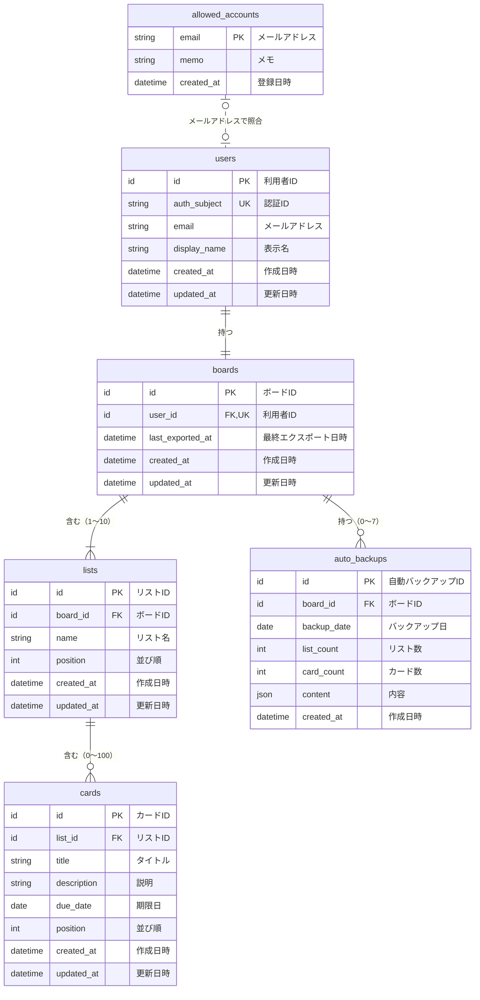

# データ設計書：かんばん式タスク管理アプリ（Trello風）

| 項目 | 内容 |
| --- | --- |
| 文書番号 | KANBAN-BD-DATA |
| 版数 | 0.3 |
| 作成日 | 2026-10-03 |
| 最終更新日 | 2026-10-03 |
| 作成者 | （氏名） |
| 上位文書 | [基本設計書](basic-design.md)（KANBAN-BD） |
| 元にした文書 | [データ要件定義書](../requirements/data-requirements.md)、[機能要件定義書](../requirements/functional-requirements.md)（要件定義書 版数 0.5） |
| 状態 | 承認待ち |

## 改訂履歴

| 版数 | 日付 | 内容 | 作成者 |
| --- | --- | --- | --- |
| 0.3 | 2026-10-03 | 基本設計書 版数 0.2 の 3 章（データ設計）を分けて作成。章番号を振り直し、参照先を新しい文書に変更。内容の変更なし | （氏名） |

本書は基本設計書の一部である。承認は[基本設計書](basic-design.md)で一括して行う。表記のルールは基本設計書 1.3 のとおり。

本書は論理設計（RDB を使うこと（要件定義書 P-1）だけを前提とし、製品には依存しない）である。選んだ製品に合わせた物理設計は、技術選定の後で行う（基本設計書 2.1）。

---

## 1. 方針

| No | 方針 | 理由 |
| --- | --- | --- |
| 1 | RDB で扱う形（表と表のつながり）で設計し、第 3 正規形を基本とする | P-1。同じデータを 2 か所に持たないことで、食い違いを防ぐ |
| 2 | 各データを区別する ID は、推測されにくい一意の値（UUID など）とする | 連番だと、ほかの利用者のデータの ID を推測しやすくなるため |
| 3 | 削除は、データを実際に消す方式（物理削除）とする | 「元に戻す」機能がなく（要件定義書 2.2）、復元はバックアップで行うため |
| 4 | 日時はタイムゾーン付きで保存し、画面では日本時間で表示する | 海外のサーバーを使っても時刻がずれないようにするため |
| 5 | 物理名（英語の名前）は、技術選定の後でそのまま使えるように案として付けておく | |

## 2. エンティティ一覧

| 論理名 | 物理名（案） | 内容 | 件数の目安 | 版 |
| --- | --- | --- | --- | --- |
| 許可アカウント | allowed_accounts | アプリを使ってよいメールアドレス | 最大 5 件 | 第 1 版 |
| 利用者 | users | 一度でもログインした人 | 最大 5 件 | 第 1 版 |
| ボード | boards | 利用者のボード（1 人 1 つ） | 最大 5 件 | 第 1 版 |
| リスト | lists | ボードの中の列 | 1 ボードに 1〜10 件 | 第 1 版 |
| カード | cards | タスク | 1 ボードに 0〜500 件 | 第 1 版 |
| 自動バックアップ | auto_backups | ボードの 1 日 1 回の控え | 1 ボードに 0〜7 件 | 第 2 版 |

### ボードを利用者と分けた理由

今は 1 人 1 ボードなので、利用者の項目にまとめることもできる。ただし「複数のボード」は対象外（要件定義書 2.2）として挙げており、今後追加する候補である。分けておけば、そのときに表の作りを変えずに済む。

## 3. ER 図



線の記号の意味：`||` はちょうど 1、`|o` は 0 または 1、`|{` は 1 以上、`o{` は 0 以上。点線（`..`）は、外部キーでつながっていない関係を表す。

## 4. エンティティ定義

型の書き方：ID ＝ 1 の方針 2 の一意の値、文字列(n) ＝ 最大 n 文字、整数、日付（年月日）、日時（タイムゾーン付き）、JSON。

### 4.1 許可アカウント（allowed_accounts）

| No | 論理名 | 物理名（案） | 型 | 必須 | キー | 初期値 | 説明 |
| --- | --- | --- | --- | --- | --- | --- | --- |
| 1 | メールアドレス | email | 文字列(254) | ○ | 主キー | | すべて小文字にして保存する |
| 2 | メモ | memo | 文字列(100) | | | 空 | 誰のアカウントか（例：「作成者」「検収者」） |
| 3 | 登録日時 | created_at | 日時 | ○ | | 登録した時刻 | |

- 登録・削除は作成者が管理者としてデータベースに直接行う。アプリの画面からは行わない（手順は基本設計書 2.2 の運用設計で定める）
- 利用者とは外部キーでつながない。許可リストから外しても、その利用者のデータは消さずに残し、再び登録すれば元のデータを使える

### 4.2 利用者（users）

| No | 論理名 | 物理名（案） | 型 | 必須 | キー | 初期値 | 説明 |
| --- | --- | --- | --- | --- | --- | --- | --- |
| 1 | 利用者 ID | id | ID | ○ | 主キー | 自動 | |
| 2 | 認証 ID | auth_subject | 文字列(255) | ○ | 一意 | | ログインのサービス（Google）が発行する、その人固有の ID。メールアドレスは変わることがあるので、本人の確認にはこちらを使う |
| 3 | メールアドレス | email | 文字列(254) | ○ | | | ログインのたびに最新の値で上書きする。すべて小文字 |
| 4 | 表示名 | display_name | 文字列(255) | ○ | | | ログインのたびに最新の値で上書きする |
| 5 | 作成日時 | created_at | 日時 | ○ | | 作成した時刻 | |
| 6 | 更新日時 | updated_at | 日時 | ○ | | 更新した時刻 | |

### 4.3 ボード（boards）

| No | 論理名 | 物理名（案） | 型 | 必須 | キー | 初期値 | 説明 |
| --- | --- | --- | --- | --- | --- | --- | --- |
| 1 | ボード ID | id | ID | ○ | 主キー | 自動 | |
| 2 | 利用者 ID | user_id | ID | ○ | 外部キー（users）・一意 | | 一意にすることで「1 人 1 ボード」を守る |
| 3 | 最終エクスポート日時 | last_exported_at | 日時 | | | なし | 一度もエクスポートしていない場合は値なし（K-8） |
| 4 | 作成日時 | created_at | 日時 | ○ | | 作成した時刻 | |
| 5 | 更新日時 | updated_at | 日時 | ○ | | 更新した時刻 | |

### 4.4 リスト（lists）

| No | 論理名 | 物理名（案） | 型 | 必須 | キー | 初期値 | 説明 |
| --- | --- | --- | --- | --- | --- | --- | --- |
| 1 | リスト ID | id | ID | ○ | 主キー | 自動 | |
| 2 | ボード ID | board_id | ID | ○ | 外部キー（boards） | | |
| 3 | リスト名 | name | 文字列(20) | ○ | | | 前後の空白を取り除いた後で 1〜20 文字 |
| 4 | 並び順 | position | 整数 | ○ | | | 左から 0, 1, 2 …（BR-3） |
| 5 | 作成日時 | created_at | 日時 | ○ | | 作成した時刻 | |
| 6 | 更新日時 | updated_at | 日時 | ○ | | 更新した時刻 | |

### 4.5 カード（cards）

| No | 論理名 | 物理名（案） | 型 | 必須 | キー | 初期値 | 説明 |
| --- | --- | --- | --- | --- | --- | --- | --- |
| 1 | カード ID | id | ID | ○ | 主キー | 自動 | |
| 2 | リスト ID | list_id | ID | ○ | 外部キー（lists） | | |
| 3 | タイトル | title | 文字列(100) | ○ | | | 前後の空白を取り除いた後で 1〜100 文字 |
| 4 | 説明 | description | 文字列(1000) | ○ | | 空文字 | 説明がない状態は、「値なし」ではなく空文字 1 種類で表す（「ない」の表し方を 2 通りにしないため） |
| 5 | 期限日 | due_date | 日付 | | | なし | 期限がない場合は値なし |
| 6 | 並び順 | position | 整数 | ○ | | | 上から 0, 1, 2 …（BR-3） |
| 7 | 作成日時 | created_at | 日時 | ○ | | 作成した時刻 | |
| 8 | 更新日時 | updated_at | 日時 | ○ | | 更新した時刻 | 別のリストへの移動、並べ替えでも更新する |

カードにはボード ID を持たせない。リスト ID からたどれるため（1 の方針 1）。

### 4.6 自動バックアップ（auto_backups）（第 2 版）

| No | 論理名 | 物理名（案） | 型 | 必須 | キー | 初期値 | 説明 |
| --- | --- | --- | --- | --- | --- | --- | --- |
| 1 | 自動バックアップ ID | id | ID | ○ | 主キー | 自動 | |
| 2 | ボード ID | board_id | ID | ○ | 外部キー（boards） | | |
| 3 | バックアップ日 | backup_date | 日付 | ○ | | | パソコンの日付（K-10）。ボード ID とバックアップ日の組み合わせを一意にし、「1 日 1 回」を守る |
| 4 | リスト数 | list_count | 整数 | ○ | | | G-5 の表示用 |
| 5 | カード数 | card_count | 整数 | ○ | | | G-5 の表示用 |
| 6 | 内容 | content | JSON | ○ | | | 8 のファイル形式と同じ内容 |
| 7 | 作成日時 | created_at | 日時 | ○ | | 作成した時刻 | G-5 の「日時」に表示 |

リスト数とカード数は「内容」から数えられるので、本来は持たなくてよい項目である。一覧を表示するたびに最大 7 件の「内容」を全部読むのを避けるため、あえて持たせる。バックアップは作成後に変更しないため、食い違いは起きない。

## 5. リレーションシップ定義

| 親 | 子 | 多重度 | 親を削除したときの子 | 説明 |
| --- | --- | --- | --- | --- |
| 利用者 | ボード | 1 対 1 | 一緒に削除 | 利用者を削除する機能はない。運用で削除する場合に備えて決めておく |
| ボード | リスト | 1 対 1〜10 | 一緒に削除 | |
| リスト | カード | 1 対 0〜100 | 一緒に削除 | L-8 |
| ボード | 自動バックアップ | 1 対 0〜7 | 一緒に削除 | |
| 許可アカウント | 利用者 | 0..1 対 0..1 | 影響なし | 外部キーではなく、ログイン時にメールアドレスで照合する（4.1） |

## 6. データのルール

| ID | ルール | 関連要件 |
| --- | --- | --- |
| BR-1 | 1 つのボードのリストは 1〜10 個 | L-5、L-9 |
| BR-2 | 1 つのリストのカードは 0〜100 枚、1 つのボードのカードは 0〜500 枚 | C-5 |
| BR-3 | 並び順は、同じボードのリストどうし・同じリストのカードどうしで 0 から始まる連番とし、重複も欠番も作らない。追加・削除・移動・並べ替えのたびに、影響する範囲を振り直す | C-7、C-10 |
| BR-4 | 文字列は前後の空白を取り除いてから保存する | C-3、L-3 |
| BR-5 | 自動バックアップは 1 ボードにつき 1 日 1 件まで、最大 7 件。8 件目を作るときは、バックアップ日が最も古いものを削除する | K-10、K-11 |
| BR-6 | 次の処理は、関係する変更をまとめて行い、全部成功するか全部やめるかのどちらかにする（途中までの状態を残さない）：初回のボード作成、カードの移動・並べ替え・削除、リストの削除、インポート、復元、自動バックアップの作成 | D-6 |
| BR-7 | 変更するたびに更新日時を更新する。同じデータへの変更が重なった場合は、後から届いた変更を有効にする | D-7 |
| BR-8 | 利用者は、自分のボードと、その中のリスト・カード・自動バックアップだけを読み書きできる。これをサーバー側で制限する | N-10〜N-12 |
| BR-9 | BR-1・BR-2 の上限の確認はサーバー側でも行う（2 つの画面から同時に追加した場合でも上限を超えないようにするため） | C-5 |

## 7. CRUD 表

C ＝ 作成、R ＝ 読み取り、U ＝ 更新、D ＝ 削除

| 機能 | 要件 | 許可アカウント | 利用者 | ボード | リスト | カード | 自動バックアップ |
| --- | --- | --- | --- | --- | --- | --- | --- |
| ログイン | A-2、A-3 | R | C R U | | | | |
| 初回のボード作成 | B-1 | | | C | C | | |
| ボード表示 | B-2 | | R | R | R | R | |
| カード追加 | C-1 | | | | R | C R | |
| カード削除 | C-6 | | | | | U D | |
| カード移動・並べ替え | C-7、C-10、C-11 | | | | R | R U | |
| カード編集 | C-13 | | | | | U | |
| リスト追加 | L-2 | | | | C R | | |
| リスト名変更 | L-6 | | | | U | | |
| リスト削除 | L-8 | | | | U D | D | |
| エクスポート | K-1 | | | R U | R | R | |
| バックアップ案内 | K-8 | | | R | | | |
| インポート | K-6 | | | | C D | C D | |
| 自動バックアップ作成 | K-10、K-11 | | | | R | R | C R D |
| 自動バックアップ一覧 | K-12 | | | | | | R |
| 復元 | K-13 | | | | C D | C D | R |

## 8. エクスポートファイルの形式（K-3）

自動バックアップの「内容」も同じ形式とする。

```json
{
  "formatVersion": 1,
  "exportedAt": "2026-10-03T15:30:00+09:00",
  "lists": [
    {
      "name": "未着手",
      "position": 0,
      "createdAt": "2026-10-01T09:00:00+09:00",
      "updatedAt": "2026-10-01T09:00:00+09:00",
      "cards": [
        {
          "title": "買い物",
          "description": "牛乳、卵、パン",
          "dueDate": "2026-10-15",
          "position": 0,
          "createdAt": "2026-10-02T10:00:00+09:00",
          "updatedAt": "2026-10-02T10:05:00+09:00"
        }
      ]
    }
  ]
}
```

| 項目 | 型 | 必須 | 条件 |
| --- | --- | --- | --- |
| formatVersion | 整数 | ○ | 1 |
| exportedAt | 日時（ISO 8601 形式） | ○ | |
| lists | 配列 | ○ | 1〜10 個 |
| lists[].name | 文字列 | ○ | 前後の空白を取り除いた後で 1〜20 文字 |
| lists[].position | 整数 | ○ | 0 から始まる連番 |
| lists[].createdAt / updatedAt | 日時（ISO 8601 形式） | ○ | |
| lists[].cards | 配列 | ○ | 0〜100 個。全リスト合計で 0〜500 個 |
| cards[].title | 文字列 | ○ | 前後の空白を取り除いた後で 1〜100 文字 |
| cards[].description | 文字列 | ○ | 0〜1,000 文字 |
| cards[].dueDate | 日付（YYYY-MM-DD）または null | ○ | |
| cards[].position | 整数 | ○ | リストの中で 0 から始まる連番 |
| cards[].createdAt / updatedAt | 日時（ISO 8601 形式） | ○ | |

- ID はファイルに含めない。インポート・復元のときは新しい ID を付ける（ほかのデータと ID がぶつかるのを防ぐため）
- 作成日時・更新日時は、ファイルの値をそのまま戻す
- 上の条件を 1 つでも満たさないファイルは、読み込まずに M-12 を表示する（K-7）
- 上限いっぱいのデータでエクスポートすると約 1.7MB になる（9）。読み込めるのは 3MB までとする（K-7）

## 9. データ量の見積もり

日本語 1 文字を 3 バイトとして、最も多い場合を計算する。

| 対象 | 計算 | 量 |
| --- | --- | --- |
| カード 1 枚 | タイトル 100 文字 × 3 ＋ 説明 1,000 文字 × 3 ＋ その他 約 200 | 約 3.5KB |
| ボード 1 つ（カード 500 枚） | 3.5KB × 500 ＋ リスト | 約 1.7MB |
| 自動バックアップ（7 件） | 1.7MB × 7 | 約 12MB |
| 利用者 1 人分 | 1.7MB ＋ 12MB | 約 14MB |
| 全体（5 人） | 14MB × 5 | 約 70MB |

技術選定では、無料プランのデータベースの容量がこの量（約 70MB）を超えていることを確認する（[技術スタック定義書](../tech-stack.md) 2 章）。
