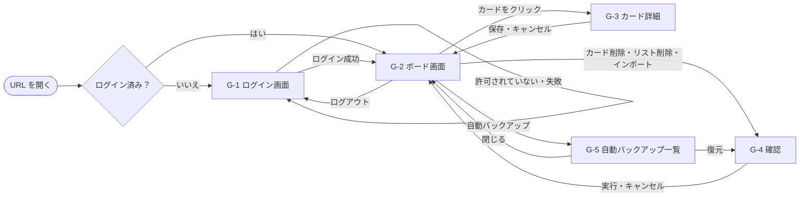

# 画面設計書：かんばん式タスク管理アプリ（Trello風）

| 項目 | 内容 |
| --- | --- |
| 文書番号 | KANBAN-BD-SCR |
| 版数 | 0.3 |
| 作成日 | 2026-10-03 |
| 最終更新日 | 2026-10-03 |
| 作成者 | （氏名） |
| 上位文書 | [基本設計書](basic-design.md)（KANBAN-BD） |
| 元にした文書 | [画面一覧](../requirements/screens.md)、[機能要件定義書](../requirements/functional-requirements.md)（要件定義書 版数 0.5） |
| 状態 | 承認待ち |

## 改訂履歴

| 版数 | 日付 | 内容 | 作成者 |
| --- | --- | --- | --- |
| 0.3 | 2026-10-03 | 基本設計書 版数 0.2 の 2 章（画面設計）を分けて作成。章番号を振り直し、参照先を新しい文書に変更。内容の変更なし | （氏名） |

本書は基本設計書の一部である。承認は[基本設計書](basic-design.md)で一括して行う。表記のルールは基本設計書 1.3 のとおり。

---

## 1. 画面一覧

| 画面 ID | 名称 | 種類 | 版 | 関連要件 |
| --- | --- | --- | --- | --- |
| G-1 | ログイン画面 | 画面 | 第 1 版 | A-1〜A-3 |
| G-2 | ボード画面 | 画面 | 第 1 版（一部第 2 版） | B、L、C、D、K の各要件 |
| G-3 | カード詳細ダイアログ | ダイアログ | 第 2 版 | C-12〜C-16 |
| G-4 | 確認ダイアログ | ダイアログ | 第 1 版 | C-6、L-8、K-5、K-13 |
| G-5 | 自動バックアップ一覧ダイアログ | ダイアログ | 第 2 版 | K-12、K-13 |

## 2. 画面遷移図



G-5 から開いた G-4 で「置き換える」を押した場合は、G-4 と G-5 を両方閉じて G-2 に戻る。「キャンセル」の場合は G-5 に戻る。

## 3. 共通仕様

### 3.1 色

| 名前 | 用途 | 色 |
| --- | --- | --- |
| 画面背景 | ボード画面・ログイン画面の背景 | #F4F5F7 |
| リスト背景 | リストの背景 | #EBECF0 |
| カード背景 | カード・ダイアログ・ヘッダーの背景 | #FFFFFF |
| 文字 | 通常の文字 | #172B4D |
| 補足文字 | 件数・日時など | #5E6C84 |
| 主色 | 主ボタンの背景、挿入位置の線 | #0052CC |
| 危険色 | 削除ボタンの背景、エラーの文字、「期限切れ」 | #AE2A19 |
| 注意色 | 「今日まで」の文字 | #A54800 |
| ドロップ先 | ドラッグ中、離すと入る先のリストの背景 | #DEEBFF |
| お知らせ（注意） | バックアップ案内の背景 | #FFF4E5 |
| お知らせ（警告） | 通信切れの背景 | #FFEBE6 |
| 背景の覆い | ダイアログを開いたときに後ろの画面を覆う色 | 黒・透明度 50% |

文字と背景の組み合わせは、実装時にコントラストを確認するツールで 4.5:1 以上（N-16）であることを確かめる。

### 3.2 文字

| 対象 | 大きさ | 太さ |
| --- | --- | --- |
| アプリ名（ヘッダー） | 20px | 太字 |
| ダイアログの見出し | 18px | 太字 |
| リスト名 | 16px | 太字 |
| その他すべて | 14px | 標準 |

書体は、Windows では「メイリオ」または「Yu Gothic UI」、macOS では「ヒラギノ角ゴシック」を使う（OS に入っているものを使い、書体ファイルは配布しない）。

### 3.3 ボタン

| 種類 | 見た目 | 使う場所 |
| --- | --- | --- |
| 主ボタン | 主色の背景・白い文字 | 追加、保存、Google でログイン |
| 通常ボタン | 枠線のみ・文字色 | キャンセル、閉じる、ヘッダーのボタン |
| 危険ボタン | 危険色の背景・白い文字 | 削除、置き換える |

- 高さ 32px、角の丸み 4px、左右の余白 12px
- マウスを乗せるとカーソルを指の形にし、背景を 10% 暗くする（N-18）
- 押せない状態のときは、透明度 50% で表示し、カーソルを禁止マークにする

### 3.4 メッセージの表示方法

| 方法 | 位置 | 消えるとき | 使うメッセージ |
| --- | --- | --- | --- |
| 入力欄の下 | 入力欄のすぐ下に危険色の文字 | その入力欄に文字を入力したとき、または入力欄を閉じたとき | M-3、M-4、M-5 |
| お知らせ欄 | ヘッダーのすぐ下、画面の横幅いっぱい | 原因がなくなったとき | M-8、M-13 |
| トースト | 画面の下中央、幅 360px の枠。右端に「×」 | 「×」を押したとき、または次の操作をしたとき。同時に表示するのは 1 つで、新しいものが出たら古いものは消す | M-9、M-11、M-12、M-14 |
| ダイアログ | G-4 | ボタンを押したとき | M-6、M-7、M-10 |
| ログイン画面 | 「Google でログイン」ボタンの下 | 次に「Google でログイン」を押したとき | M-1、M-2 |

### 3.5 ダイアログ共通

- 画面の中央に表示し、後ろの画面を「背景の覆い」で覆う。開いている間は後ろの画面を操作できない
- Esc キー、または覆いの部分のクリックで、「キャンセル」と同じ動きをする
- 開いたときは、G-3 ではタイトル入力欄に、G-4・G-5 では「キャンセル」「閉じる」ボタンにカーソルを置く（Enter キーを押したときに、データが失われる操作を誤って実行しないため）

### 3.6 画面の状態と、できる操作

| 状態 | なるとき | できる操作 |
| --- | --- | --- |
| 読み込み中 | ボードのデータを読み込んでいる間（B-3） | ログアウトのみ |
| 通常 | 上記以外 | すべての操作 |
| 通信切れ | インターネットに接続できないとき（D-4） | ログアウトのみ。追加・削除・移動・変更に加え、エクスポート・インポート・自動バックアップの表示と復元もできない（D-4） |

できない操作のボタン・入力欄は「押せない状態」で表示し、カードはドラッグできないようにする。

### 3.7 入力の共通ルール

- 1 行の入力欄で Enter キーを押すと、その入力欄の「追加」または「保存」と同じ動きをする
- 日本語入力の変換を確定するための Enter キーでは追加・保存しない
- 前後の空白（半角スペース・全角スペース・タブ・改行）を取り除いてから、文字数の確認と保存を行う
- 文字数の上限を超える文字は入力できないようにする。文字数は要件定義書の用語「文字数」のとおり、Unicode の文字（コードポイント）単位で数える

### 3.8 日付・日時の表示

- 日付：「2026/10/15」
- 日時：「2026/10/03 15:30」（日本時間、24 時間表記）

## 4. G-1 ログイン画面

### レイアウト

```
┌──────────────────────────────────────────┐
│                                          │
│              タスクボード                 │
│                                          │
│         [  Google でログイン  ]          │
│      このアカウントでは利用できません。    │ ← メッセージ（ある場合のみ）
│                                          │
└──────────────────────────────────────────┘
```

画面の中央に、幅 360px の白い枠で表示する。

### 表示項目

| No | 項目 | 種類 | 内容 |
| --- | --- | --- | --- |
| 1 | アプリ名 | 文字 | 「タスクボード」 |
| 2 | Google でログイン | 主ボタン | |
| 3 | メッセージ | 文字（危険色） | M-1 または M-2。ない場合は表示しない |

### 操作

| 操作 | 処理 | 結果 | 要件 |
| --- | --- | --- | --- |
| 「Google でログイン」を押す | Google のログイン画面を別ウィンドウで開く | | A-1 |
| Google でログインが完了 | 許可リストを確認する | 許可されていれば G-2 を表示。許可されていなければログアウトさせ、M-1 を表示 | A-2、A-3 |
| ログインのウィンドウを閉じた・失敗した | | M-2 を表示 | M-2 |

## 5. G-2 ボード画面

### レイアウト

```
┌──────────────────────────────────────────────────────────────────────────┐
│ タスクボード    山田 太郎 [エクスポート][インポート][自動バックアップ][ログアウト] │ ← ヘッダー 高さ 56px
├──────────────────────────────────────────────────────────────────────────┤
│ ⚠ 最後のバックアップから 7 日以上たっています。 [エクスポート]           │ ← お知らせ欄（ある場合のみ）
├──────────────────────────────────────────────────────────────────────────┤
│  ┌272px─────────┐ 8px ┌──────────────┐     ┌──────────────┐ ┌──────────┐ │
│  │未着手 (2)  … │     │作業中 (1)  … │     │完了 (1)    … │ │＋リストを│ │
│  │┌────────────┐│     │┌────────────┐│     │┌────────────┐│ │  追加    │ │
│  ││買い物     ×││     ││レポート   ×││     ││掃除       ×││ └──────────┘ │
│  ││2026/10/15  ││     ││≡           ││     │└────────────┘│              │
│  ││  期限切れ  ││     │└────────────┘│     │              │              │
│  │└────────────┘│     │              │     │              │              │
│  │┌────────────┐│     │              │     │              │              │
│  ││本を返す   ×││     │              │     │              │              │
│  │└────────────┘│     │              │     │              │              │
│  │[入力欄][追加]│     │[入力欄][追加]│     │[入力欄][追加]│              │
│  └──────────────┘     └──────────────┘     └──────────────┘              │
│                                                                          │
│                     ┌ 保存に失敗しました。…        × ┐                   │ ← トースト（ある場合のみ）
└──────────────────────────────────────────────────────────────────────────┘
```

### 各部分の大きさ・配置

| 部分 | 内容 |
| --- | --- |
| ヘッダー | 高さ 56px、画面上部に固定。左右の余白 16px |
| ボード | ヘッダー（とお知らせ欄）の下の残り全体。上下左右の余白 16px。リストが入りきらないときは横スクロール |
| リスト | 幅 272px、リストどうしの間隔 8px、角の丸み 8px、内側の余白 8px。高さはカードの量に合わせて伸び、ボードの高さで止まる。止まった後はカードの部分だけ縦スクロール（リスト名と入力欄は常に見える） |
| カード | リストの幅いっぱい、カードどうしの間隔 8px、内側の余白 8px、角の丸み 4px、薄い影をつける |

### 表示項目

| No | 部分 | 項目 | 種類 | 内容 | 要件 |
| --- | --- | --- | --- | --- | --- |
| 1 | ヘッダー | アプリ名 | 文字 | 「タスクボード」 | |
| 2 | ヘッダー | 表示名 | 文字 | Google アカウントの表示名 | データ要件 5 |
| 3 | ヘッダー | エクスポート | 通常ボタン | | K-1 |
| 4 | ヘッダー | インポート | 通常ボタン | | K-4 |
| 5 | ヘッダー | 自動バックアップ | 通常ボタン | （第 2 版） | K-12 |
| 6 | ヘッダー | ログアウト | 通常ボタン | | A-5 |
| 7 | お知らせ欄 | 通信切れ | お知らせ（警告） | M-8 | D-4 |
| 8 | お知らせ欄 | バックアップ案内 | お知らせ（注意） | M-13 と「エクスポート」ボタン。通信切れと同時の場合は通信切れを上に表示 | K-8 |
| 9 | ボード | 読み込み中 | 文字 | ボード中央に「読み込み中…」 | B-3 |
| 10 | リスト | リスト名 | 文字 | 長くて入りきらない場合は折り返す | |
| 11 | リスト | カード枚数 | 補足文字 | 「(3)」の形式 | B-4 |
| 12 | リスト | 「…」 | ボタン | リストのメニューを開く（第 2 版） | L-6、L-8 |
| 13 | リスト | カード | 部品 | 並び順（データ設計書 4.5 の並び順）の小さい順に上から並べる | |
| 14 | リスト | タイトル入力欄 | 1 行入力 | 薄い文字の案内「カードのタイトル」。最大 100 文字 | C-1、C-3 |
| 15 | リスト | 追加 | 主ボタン | | C-1 |
| 16 | カード | タイトル | 文字 | 全文を表示し、入りきらない場合は折り返す | |
| 17 | カード | × | ボタン | 右上に常に表示 | C-6 |
| 18 | カード | 期限日 | 補足文字 | 「2026/10/15」。今日なら横に注意色で「今日まで」、過ぎていれば危険色で「期限切れ」（第 2 版） | C-17 |
| 19 | カード | 説明あり | 補足文字 | 「≡」（第 2 版） | C-18 |
| 20 | ボード右端 | ＋リストを追加 | 通常ボタン | リスト数が 10 のときは表示しない（第 2 版） | L-1、L-5 |
| 21 | トースト | メッセージ | 枠 | 3.4 のとおり | |

### リストのメニュー（第 2 版）

「…」を押すと、そのすぐ下に次の 2 つを縦に並べて表示する。メニューの外をクリックするか Esc キーで閉じる。

| 項目 | 内容 |
| --- | --- |
| 名前を変更 | リスト名を入力欄に変える（L-6） |
| 削除 | G-4 を開く（L-8）。リストが 1 つのときは押せない状態にする（L-9） |

### 操作

| 操作 | 処理 | 成功したとき | 失敗したとき | 要件 |
| --- | --- | --- | --- | --- |
| 「追加」・Enter（カード） | 入力値の確認 → 保存 | リストの一番下にカードを表示。入力欄を空にしてカーソルを残す | 空：M-3、上限：M-5 を入力欄の下に表示。保存失敗：M-9 を表示し、カードを消して入力欄に文字を戻す | C-1〜C-5、D-6 |
| 「×」（カード） | G-4 を開く。「削除」で削除して保存 | カードを消し、下のカードを詰める | M-9 を表示し、カードを元に戻す | C-6、D-6 |
| カードをドラッグ | ドラッグ中のカードを透明度 50% で表示。離すと入る先のリストの背景をドロップ先の色にする（第 2 版：入る位置に主色で太さ 2px の線を表示） | | | C-8、C-10 |
| 別のリストの上で離す | 移動して保存 | 第 1 版：そのリストの一番下に表示。第 2 版：線の位置に表示 | M-9 を表示し、元の位置に戻す | C-7、C-11、D-6 |
| 同じリストで離す（第 2 版） | 並べ替えて保存 | 線の位置に表示 | M-9 を表示し、元の位置に戻す | C-10 |
| リストの外で離す | 何もしない | 元の位置に戻す | | C-9 |
| 上限（100 枚）のリストに離す | 移動しない | 元の位置に戻し、M-5 をトーストで表示 | | C-5 |
| カードをクリック（第 2 版） | G-3 を開く | | | C-12 |
| 「＋リストを追加」（第 2 版） | ボタンを、リスト名の入力欄・「追加」「×」に置き換える | | | L-1 |
| 「追加」・Enter（リスト）（第 2 版） | 入力値の確認 → 保存 | 右端にリストを表示し、入力欄を閉じる | 空：M-4。保存失敗：M-9 | L-2〜L-5 |
| 「×」・Esc（リスト追加）（第 2 版） | 入力欄を閉じる | | | |
| 名前を変更 → Enter・外をクリック（第 2 版） | 入力値の確認 → 保存 | 新しい名前を表示 | 空：元の名前に戻す。保存失敗：M-9、元の名前に戻す | L-6 |
| 名前を変更 → Esc（第 2 版） | 取り消す | 元の名前に戻す | | L-6 |
| 削除（リスト）（第 2 版） | G-4 を開く。「削除」でリストと中のカードを削除して保存 | リストを消し、右側のリストを左に詰める | M-9、元に戻す | L-8 |
| 「エクスポート」 | ファイルを作ってダウンロードし、最終エクスポート日時を保存 | ダウンロードが始まり、バックアップ案内を消す | M-9 | K-1〜K-3、K-8 |
| 「インポート」 | ファイル選択画面を開く（.json のみ）→ ファイルを確認 → G-4 を開く。「置き換える」で置き換えて保存 | ボードを表示し直し、M-11 を表示 | ファイルの問題：M-12。保存失敗：M-9 で、データは変えない | K-4〜K-7 |
| 「自動バックアップ」（第 2 版） | G-5 を開く | | | K-12 |
| 「ログアウト」 | ログアウト | G-1 を表示 | | A-5 |
| ほかの画面での変更を受け取る | 画面に反映する | 5 秒以内に表示が変わる。G-3 で編集中のカードがほかの画面で削除された場合は、G-3 を閉じて M-14 を表示 | | D-3、D-8 |

画面への反映は、保存の完了を待たずに行う（N-2 の 0.5 秒を守るため）。保存に失敗した場合は、上の表の「失敗したとき」のとおり元に戻す。

## 6. G-3 カード詳細ダイアログ（第 2 版）

### レイアウト

```
┌ カードの詳細 ─────────────────────────────── ┐
│ タイトル                                       │
│ [ 買い物                                     ] │
│                                                │
│ 説明                                            │
│ ┌────────────────────────────────────────────┐ │
│ │ 牛乳、卵、パン                              │ │
│ │                                             │ │
│ └────────────────────────────────────────────┘ │
│                                      12 / 1000 │
│ 期限日                                          │
│ [ 2026/10/15 ] [期限をなくす]                   │
│                                                │
│ 作成：2026/10/03 15:30   更新：2026/10/04 09:12 │
│                                                │
│                          [キャンセル] [ 保存 ]  │
└────────────────────────────────────────────────┘
```

幅 600px。

### 表示項目

| No | 項目 | 種類 | 内容 | 要件 |
| --- | --- | --- | --- | --- |
| 1 | タイトル | 1 行入力 | 最大 100 文字。入力エラーのときは下に M-3 | C-14 |
| 2 | 説明 | 複数行入力 | 高さ 6 行分。超えたら入力欄の中で縦スクロール。最大 1,000 文字 | C-15 |
| 3 | 文字数 | 補足文字 | 「現在の文字数 / 1000」 | |
| 4 | 期限日 | 日付入力 | 押すとカレンダーを表示 | C-16 |
| 5 | 期限をなくす | 通常ボタン | 期限日を空にする | C-16 |
| 6 | 作成日時・更新日時 | 補足文字 | 表示のみ | |
| 7 | キャンセル | 通常ボタン | | C-13 |
| 8 | 保存 | 主ボタン | | C-13 |

### 操作

| 操作 | 結果 | 要件 |
| --- | --- | --- |
| 「保存」・タイトル欄で Enter | 入力値を確認し、保存してダイアログを閉じる。タイトルが空なら M-3 を表示して閉じない。保存に失敗したら M-9 を表示し、ダイアログは開いたまま入力内容を残す（もう一度「保存」を押せる） | C-13、C-14、D-6 |
| 「キャンセル」・Esc・覆いのクリック | 確認なしで、変更を捨てて閉じる | C-13 |

## 7. G-4 確認ダイアログ

### レイアウト

```
┌ カードの削除 ──────────────────────┐
│                                      │
│ カード「買い物」を削除しますか？      │
│                                      │
│              [キャンセル] [ 削除 ]   │
└──────────────────────────────────────┘
```

幅 400px。

### 用途ごとの内容

| 用途 | 見出し | メッセージ | 実行ボタン | 要件 |
| --- | --- | --- | --- | --- |
| カードの削除 | カードの削除 | M-6 | 削除（危険ボタン） | C-6 |
| リストの削除 | リストの削除 | M-7 | 削除（危険ボタン） | L-8 |
| インポート | インポート | M-10 | 置き換える（危険ボタン） | K-5 |
| 自動バックアップからの復元 | 復元 | M-10 | 置き換える（危険ボタン） | K-13 |

メッセージ中のタイトル・リスト名が 30 文字を超える場合は、31 文字目以降を「…」に置き換える。

## 8. G-5 自動バックアップ一覧ダイアログ（第 2 版）

### レイアウト

```
┌ 自動バックアップ ───────────────────────────┐
│    日時                リスト   カード        │
│ ( ) 2026/10/10 08:15     3        12          │
│ (●) 2026/10/09 21:03     3        11          │
│ ( ) 2026/10/08 07:40     3         9          │
│                                               │
│                         [閉じる] [ 復元 ]     │
└───────────────────────────────────────────────┘
```

幅 480px。

### 表示項目・操作

| No | 項目 | 内容 | 要件 |
| --- | --- | --- | --- |
| 1 | 一覧 | 日時・リストの数・カードの枚数を新しい順に最大 7 行。行のどこを押しても選択できる | K-12 |
| 2 | 0 件のとき | 一覧の代わりに「自動バックアップはまだありません。」 | |
| 3 | 閉じる | ダイアログを閉じる | |
| 4 | 復元 | 1 行選ぶまでは押せない。押すと G-4（復元）を開く | K-13 |
